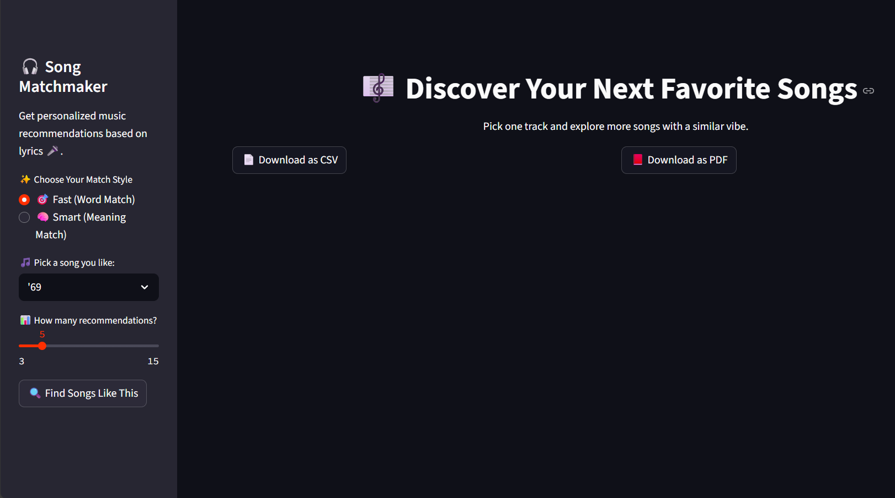
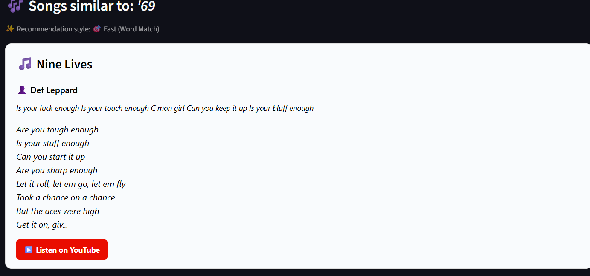

# 🎧 English Song Recommender App

Welcome to the **English Song Recommender** — a web application that suggests songs with similar *lyrics and emotions* using two powerful approaches:  
- **TF-IDF (Fast)**: Uses word similarity  
- **BERT (Smart)**: Understands deep meaning and context


> 🔗 **Live Demo**:  
👉 [Enjoy The Service Now!](https://englishsongrecommneder-w4m7cu4wufjp9s57j6y3gd.streamlit.app/)

Built using **Streamlit**, this app provides a clean, interactive interface to discover songs based on the lyrics of one you already love.

---

## 📸 Preview

| Sidebar Interface                        | Recommendations UI                       |
|------------------------------------------|-------------------------------------------|
|  |  |


---

## 🚀 What This App Does

🔍 **You provide** the name of a song from the dataset.  
🤖 **The system finds** similar songs based on their lyrics using:
- **TF-IDF (Fast)**: Compares word usage
- **BERT (Smart)**: Compares semantic meaning via Hugging Face transformers  

🎤 You get:
- Song title & artist  
- Short lyrics preview  
- YouTube link to listen  
- Export to **CSV** or **PDF**

---

## 📦 Project Structure

```
english_song_recommender/
│
├── main.py # Streamlit UI
├── preprocess.py # Clean and process lyrics
├── recommend.py # Core logic for TF-IDF and BERT-based recommendations
├── spotify_millsongdata.csv # Raw dataset
├── requirements.txt
├── nltk_data/ # Contains downloaded NLTK stopwords
├── df_cleaned.pkl # Cleaned data
├── tfidf_matrix.pkl # TF-IDF matrix
├── cosine_sim.pkl # TF-IDF similarity matrix
├── bert_embeddings.pkl # BERT embeddings
└── screenshots/ # UI screenshot images
```

---

## 🛠️ How It Works

### 1. **Lyrics Preprocessing** (`preprocess.py`)
- Clean each song's lyrics (remove punctuation, lowercase, remove stopwords)
- Convert text to TF-IDF matrix
- Generate BERT embeddings using `sentence-transformers` Hugging Face model (`all-MiniLM-L6-v2`)
- Save the outputs to `.pkl` files for efficient reuse

### 2. **Recommendation Engine** (`recommend.py`)
- Given a song name, find its vector (TF-IDF or BERT)
- Calculate similarity between this vector and all others
- Return top N matches with song, artist, and lyrics preview

### 3. **User Interface** (`main.py`)
- Choose song and method (Fast/Smart)
- Show results as cards
- Export as CSV or PDF

---

## 🧪 Installation & Setup

### 1. Clone the Repo
```bash
git clone https://github.com/your-username/english_song_recommender.git
cd english_song_recommender
```
### 2. Create Virtual Environment
```bash
python -m venv venv
source venv/bin/activate  # Windows: venv\Scripts\activate
```

### 3. Install Requirements
```bash
pip install -r requirements.txt
# Windows: venv\Scripts\activate
```
### 4. Preprocess the Lyrics
```bash
python preprocess.py

# This creates these files:
# df_cleaned.pkl
# tfidf_matrix.pkl
# cosine_sim.pkl
# bert_embeddings.pkl

```
### 5. Run the App
```bash
streamlit run main.py

```

## 💬 Export Options
Once recommendations are displayed, you can export the results:

- 🗂 CSV: Table format with all info
- 📄 PDF: Card-style printable version with lyrics preview

## 📚 Dataset Source
- [🎶 Millsong Lyrics Dataset (Kaggle)](https://www.kaggle.com/datasets/notshrirang/spotify-million-song-dataset)
- Cleaned and sampled 10,000 songs for performance

## 🧠 Models Used

### ✅ TF-IDF (Fast Match)
- Converts lyrics to word-frequency vectors
- Uses cosine similarity for comparison

### 🤖 BERT (Smart Match)
- Uses Hugging Face's sentence-transformers
- Captures meaning, emotion, and nuance in lyrics
- Model used: all-MiniLM-L6-v2 (fast and efficient)

### ✅ Requirements
```bash
streamlit
pandas
scikit-learn
nltk
joblib
fpdf
sentence-transformers
```


